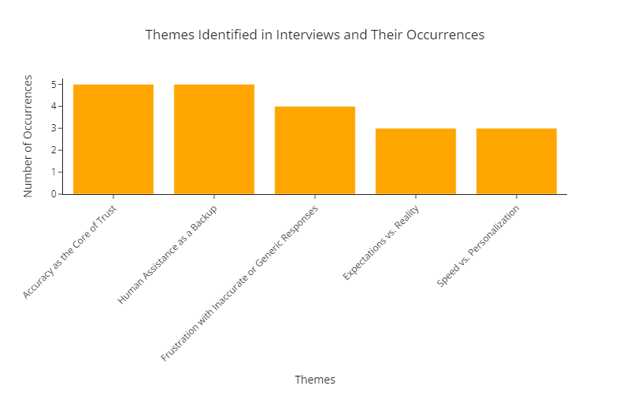

# Balancing Automation and Human Support: Chatbot Accuracy and Customer Trust in SMEs

A mixed-methods research study investigating how chatbot accuracy impacts customer trust compared to traditional human assistance in small and medium enterprises (SMEs). Individual qualitative research conducted as part of a larger team study for Digiwerkplaats on consumer attitudes toward chatbot technology.

## 🎯 Project Overview

This research explores the critical question: **How does the accuracy of chatbots in SMEs compare to traditional human assistance in terms of customer trust?**

As part of the Analytics Translator role, this study bridges technical AI capabilities and business strategy, translating complex consumer insights into actionable recommendations for SMEs navigating digital transformation.

### The Business Challenge

While chatbot technology offers SMEs 24/7 customer service and cost efficiency, customer trust remains inconsistent. SMEs need evidence-based guidance on:
- When chatbots enhance vs. harm customer relationships
- How chatbot accuracy impacts brand perception and trust
- Optimal balance between automation and human support
- Industry-specific considerations for chatbot deployment

### Research Context

**Team Research Question (Group Chatbot-3):**  
*How do various aspects of chatbot interactions, including personalisation, perceived waiting times, accuracy, and functionality preferences, relate to customer satisfaction and trust in SMEs?*

**My Individual Research Question (Qualitative Focus):**  
*How does the accuracy of chatbots in SMEs compare to traditional human assistance in terms of customer trust?*

## 🔬 Research Methodology

### My Individual Qualitative Study

**Research Design:**
- **Approach:** Qualitative research with semi-structured interviews
- **Sample Size:** 5 in-depth interviews (originally planned 8, refined to 5 due to theme saturation)
- **Method:** Thematic analysis following Braun & Clarke (2006) framework
- **Industries:** Retail, technology, and services sectors
- **Duration:** 10-20 minutes per interview
- **Sampling:** Purposive sampling of participants with experience using both chatbots and human agents

**Key Interview Questions:**
- "Can you share an experience where a chatbot gave you either correct or incorrect information?"
- "How did the chatbot's accuracy affect your view of the company's service?"
- "When do you prefer chatbot assistance vs. human support?"

### Team Mixed-Methods Approach

**Quantitative Component (Team):**
- **Sample Size:** 150 participants via Prolific
- **Design:** Cross-sectional survey via Qualtrics
- **Analysis:** Hypothesis testing (Cochran's Q, McNemar's test, t-tests, correlation analysis)
- **Focus:** Personalisation levels, waiting times, and satisfaction metrics

**Qualitative Component (Team):**
- Multiple team members conducted interviews (5-8 interviews each)
- Systematic thematic coding across all interviews
- Integration of findings for comprehensive policy recommendations

## 📊 Key Findings (My Qualitative Research)

### 5 Major Themes Identified

**1. Accuracy as the Core of Trust** (Most Frequent Theme)
- Accurate responses build trust in both chatbot and company
- Even small errors significantly undermine customer confidence
- Participants expect chatbot reliability for simple inquiries
- Inaccuracies are seen as unacceptable failures affecting brand perception

**2. Human Assistance as a Backup** (Most Frequent Theme)
- Chatbots excel at straightforward questions but struggle with complexity
- Seamless handoff to human agents is critical for maintaining trust
- Proactive escalation (chatbot recognizing its limitations) is highly valued
- Human support acts as essential safety net reducing frustration

**3. Frustration with Inaccurate or Generic Responses**
- Generic, pre-scripted replies waste customer time and erode trust
- Lack of contextual understanding creates negative business perception
- Customers feel undervalued when issues aren't properly addressed
- Chatbots that don't acknowledge mistakes increase distrust

**4. Expectations vs. Reality**
- Unmet expectations cause disappointment and erode trust
- Clear communication about chatbot capabilities is essential
- Overpromising chatbot abilities leads to significant disappointment
- Transparency about limitations helps manage customer satisfaction

**5. Speed vs. Personalisation**
- Chatbots valued for speed on routine tasks
- Human agents preferred for complex, empathy-requiring interactions
- Trade-off exists between efficiency and feeling understood
- Optimal solution: chatbot speed for simple queries + human touch for complexity

### Theme Frequency Analysis



The bar chart analysis shows "Accuracy as the Core of Trust" and "Human Assistance as a Backup" appeared in all 5 interviews, emphasizing their critical importance for customer trust.

## 💼 Business Impact & Policy Recommendations

### Key Insights for SMEs

**Core Finding:** Chatbots are not a replacement for human customer service, but rather a complement. The hybrid approach maximizes efficiency while maintaining trust.

**Strategic Recommendations:**

1. **Prioritize Accuracy Over Features**
   - Ensure chatbot responses are consistently accurate for simple queries
   - Regular updates to knowledge base and product information
   - Implement quality assurance testing for chatbot responses

2. **Design Seamless Human Escalation**
   - Program chatbots to recognize their limitations
   - Enable automatic transfer to human agents for complex issues
   - Avoid requiring customers to repeat information during handoff

3. **Set Realistic Expectations**
   - Clearly communicate chatbot capabilities and limitations
   - Transparent messaging about when human support is available
   - Avoid marketing chatbots as capable of solving all problems

4. **Balance Efficiency and Personalization**
   - Deploy chatbots for routine, straightforward questions
   - Reserve human agents for empathy-requiring, nuanced situations
   - Combine speed of automation with human emotional intelligence

5. **Continuous Improvement Loop**
   - Regularly collect customer feedback on chatbot performance
   - Monitor accuracy metrics and common failure points
   - Iteratively refine chatbot responses based on real usage data

### Team Policy Paper Findings

The group policy paper integrated my qualitative findings with quantitative survey data (n=150), revealing:
- **Personalisation Impact:** Moderate positive effect, but overshadowed by responsiveness
- **Waiting Time Reduction:** Mixed results - chatbots reduce wait times but struggle with independent issue resolution
- **Accuracy Criticality:** Quantitative data underestimates accuracy's impact on trust (revealed by qualitative depth)
- **Stakeholder Analysis:** Identified 6 key stakeholder groups with tailored recommendations

## 🛠️ Technologies & Methods

### Qualitative Analysis
- **Python** - Data processing and visualization
- **Thematic Coding** - Systematic theme identification (Braun & Clarke framework)
- **Semi-Structured Interviews** - Flexible yet focused questioning
- **Microsoft Word** - Interview transcription and initial coding
- **Matplotlib** - Theme frequency visualization

### Quantitative Analysis (Team)
- **Python** - Statistical analysis
- **pandas/NumPy** - Data manipulation
- **scipy.stats** - Hypothesis testing (Cochran's Q, McNemar's, t-tests)
- **statsmodels** - Advanced statistical modeling
- **Qualtrics** - Survey platform
- **Prolific** - Participant recruitment

### Project Management & Documentation
- **Scrum Methodology** - Sprint planning, stand-ups, retrospectives
- **Trello** - Task management and tracking
- **LaTeX/Overleaf** - Academic paper writing (APA style)
- **Git/GitHub** - Version control and collaboration

## 📁 Repository Structure
```
chatbot-consumer-attitudes-research/
├── analysis/
│   ├── Qualitative_Analysis_Michon_Goddijn_231849.ipynb
│   └── Quantitative_Analysis_Michon_Goddijn_231849.ipynb
├── data/
│   ├── interviews/
│   │   ├── interview_1.txt
│   │   ├── interview_2.txt
│   │   ├── interview_3.txt
│   │   ├── interview_4.txt
│   │   └── interview_5.txt
│   └── Codebook_Template.md
├── docs/
│   ├── Conference_poster_Chatbots_3.pdf
│   └── Stakeholder_Analysis_Chatbots_3.pdf
├── papers/
│   ├── Research_Paper_Michon_Goddijn_231849.pdf
│   └── Chatbots_3_Final_Policy_Paper.pdf
├── visualizations/
│   └── theme_frequency_chart.png
├── requirements.txt
├── .gitignore
└── README.md
```

**Note:** Interview transcripts are included in this repository as they have been fully anonymized according to GDPR and BUas ethics requirements. All identifying information has been removed to protect participant privacy.

## 🚀 Getting Started

### Prerequisites
```bash
pip install -r requirements.txt
```

### Exploring the Analysis

**My Qualitative Analysis:**
```python
jupyter notebook analysis/Qualitative_Analysis_Michon_Goddijn_231849.ipynb
```

Contains:
- Interview data processing
- Systematic thematic coding (Braun & Clarke framework)
- Theme identification and frequency analysis
- Quote extraction and interpretation
- Visual representation of findings

**Team Quantitative Analysis:**
```python
jupyter notebook analysis/Quantitative_Analysis_Michon_Goddijn_231849.ipynb
```

Contains:
- Survey data cleaning and preprocessing
- Descriptive statistics
- Hypothesis testing (Cochran's Q, McNemar's, t-tests)
- Correlation analysis
- Statistical visualizations

## 📈 Research Process

### Week 1-2: Research Design & Literature Review
- Topic selection and team formation
- Stakeholder analysis for SME chatbot implementation
- Literature review on chatbot adoption and customer trust
- Research question formulation (team + individual)
- Ethics application and Data Management Plan

### Week 3-4: Study Design & Preparation
- Qualtrics survey design (team collaboration)
- Interview protocol development
- Pilot testing and refinement
- BUas Ethics Review approval
- Informed consent procedures

### Week 5: Data Collection
- Survey distribution via Prolific (n=150, 2-day collection)
- Conducted 5 semi-structured interviews
- Transcription and anonymization
- Data security and GDPR compliance

### Week 6: Data Analysis
- **Week 6 Monday:** Statistics exam ✓
- Thematic coding of interview transcripts
- Theme identification and refinement
- Frequency analysis and visualization
- Integration with team quantitative findings

### Week 7-8: Writing & Dissemination
- Individual research paper (4000 words, LaTeX/APA)
- Team policy paper with executive summary
- Conference poster design (A1 format)
- Final presentation to stakeholders
- **Week 8 Wednesday:** Conference presentation ✓

## 🎓 Academic Rigor

### Research Quality
- **CRISP-DM Framework:** Followed for structured approach
- **Braun & Clarke (2006):** Rigorous thematic analysis methodology
- **APA Style:** Proper academic citation throughout
- **Ethics Approval:** BUas Ethics Review Board clearance
- **GDPR Compliance:** Full data anonymization and secure storage

### Methodological Strengths
- **Theme Saturation:** Stopped at 5 interviews when themes began repeating
- **Cross-Validation:** Multiple team members reviewed transcripts
- **Depth Over Quantity:** Prioritized rich, detailed insights
- **Purposive Sampling:** Deliberate diversity across industries
- **Systematic Coding:** Two-phase coding (open + axial)

## 📚 Key Learnings

Through this project, I developed expertise in:

- **Qualitative Research Methods:** Semi-structured interviews, thematic analysis
- **Analytics Translation:** Converting complex research into business recommendations
- **Statistical Analysis:** Hypothesis testing, correlation, effect size calculations (team component)
- **Mixed-Methods Integration:** Combining qualitative depth with quantitative breadth
- **Academic Writing:** LaTeX, APA formatting, research paper structure
- **Stakeholder Management:** Analyzing and addressing diverse stakeholder needs
- **Project Management:** Scrum methodology with sprints and retrospectives
- **Research Ethics:** GDPR compliance, informed consent, ethical data handling
- **Data Storytelling:** Translating findings for non-technical SME audiences

## 🏆 Achievements

✅ Conducted **5 in-depth interviews** with systematic thematic analysis  
✅ Identified **5 core themes** on chatbot accuracy and customer trust  
✅ Contributed to team survey analyzing **150 participants**  
✅ Delivered **4000-word research paper** in LaTeX/APA format  
✅ Co-authored **policy paper** with actionable SME recommendations  
✅ Presented at **academic conference** with poster (Team Chatbot-3)  
✅ Passed **statistics exam** demonstrating quantitative proficiency  
✅ Managed project using **Scrum/Agile** with sprint planning and retrospectives  
✅ Completed full **Data Management Plan** with GDPR compliance  
✅ Achieved **BUas Ethics Review approval** for human subjects research  

## 🤝 Team Collaboration

**Team Chatbot-3 Members:**
- **Alexi Kehayias** - Quantitative analysis (personalisation & satisfaction)
- **Michon Goddijn** - Qualitative analysis (accuracy & trust)
- **Márk Molnár** - Quantitative analysis (waiting times & satisfaction)
- **Kamil Łega** - Qualitative analysis (functionality preferences)

**Group Deliverables:**
- Research proposal (collaborative)
- Data Management Plan with full ethics documentation
- Policy paper with stakeholder analysis
- Conference poster presentation
- Qualtrics survey design (merged across Chatbot topic teams)

**Individual Deliverables:**
- Personal research sub-question and focus
- Qualitative/quantitative analysis notebooks
- Research paper (4000 words)
- Statistics exam

## 👤 Author

**Michon Goddijn**  
Data Science & AI Student | Breda University of Applied Sciences  
[LinkedIn](#) | [Portfolio](https://michongoddijn.com) | [Email](mailto:michon.goddijn@icloud.com)

**Role:** Analytics Translator & Qualitative Researcher  
**Supervised by:** Dr. Tsegaye Tashu

## 🙏 Acknowledgments

- **Digiwerkplaats** - Project client and SME digital transformation partner
- **Interview Participants** - Valuable time and insights (anonymized for privacy)
- **Team Chatbot-3** - Collaborative research partners (Alexi, Márk, Kamil)
- **Faculty Advisors** - Dr. Margot Neggers, Dr. Alican Noyan, MA Myrthe Buckens
- **Guest Speakers** - Marco van Leeuwen (Research Ethics), Bert Heesakkers (Scrum & Data Storytelling)
- **BUas Ethics Board** - Ethics review and GDPR guidance

## 📄 Ethics & Privacy

All research conducted under BUas Ethics Review Board approval. Interview data fully anonymized with all identifying information removed. Participants provided informed consent, and data handled according to GDPR regulations.

**Data Sharing:** Anonymized interview transcripts included in repository. Survey data aggregated only (raw data not shared to protect participant privacy).

## 📚 References

**Key Methodological References:**
- Braun, V., & Clarke, V. (2006). Using thematic analysis in psychology. *Qualitative Research in Psychology, 3*(2), 77-101.
- Araujo, T. (2018). Living up to the chatbot hype. *Computers in Human Behavior, 85*, 183-189.
- Go, E., & Sundar, S. S. (2019). Humanizing chatbots. *Computers in Human Behavior, 97*, 304-316.

[Full reference list available in research paper]

---

*Year 2, Block A - Analytics Translator | October 2024*

**Tags:** `qualitative-research` `thematic-analysis` `chatbots` `customer-trust` `sme-research` `analytics-translator` `mixed-methods` `python` `scrum`
